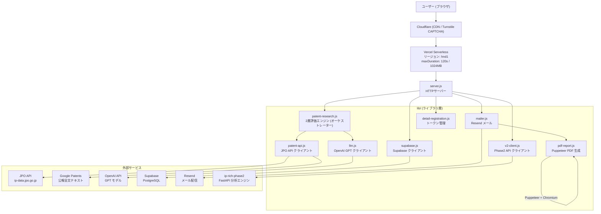

# システムアーキテクチャ仕様書

## 1. システム概要

**Patent Value Analyzer** は、特許の簡易診断から詳細評価・収益化支援までを提供するサービスです。
ユーザーが特許番号を入力するだけで、JPO公式データとAI分析に基づく収益化ポテンシャル評価を即座に提供します。

---

## 2. アーキテクチャ図



---

## 3. コンポーネント構成

### フロントエンド (`public/`)

| 種別 | 技術 | 説明 |
|------|------|------|
| UI フレームワーク | Vanilla JS | フレームワーク非依存の軽量実装 |
| スタイリング | CSS | カスタム CSS |
| CAPTCHA | Cloudflare Turnstile | ボット対策 |
| 管理画面 | `public/admin/` | 管理者向けダッシュボード |

### バックエンド

| ファイル | 役割 |
|---------|------|
| `server.js` | HTTPサーバー、ルーティング、レート制限、CSP/CORS管理 |
| `lib/patent-research.js` | 2層評価エンジン（メインオーケストレーター） |
| `lib/patent-research/scoring.js` | スコアリングロジック（ルールエンジン） |
| `lib/patent-research/constants.js` | 定数テーブル |
| `lib/patent-api.js` | JPO API クライアント + Google Patents 全文取得 |
| `lib/llm.js` | OpenAI GPT API クライアント |
| `lib/v2-client.js` | ip-rich-phase2（Phase2）API クライアント |
| `lib/mailer.js` | Resend メール送信（HTMLテンプレート内包） |
| `lib/pdf-report.js` | Puppeteer + @sparticuz/chromium-min による PDF 生成 |
| `lib/supabase.js` | Supabase クライアント（リード/特許情報保存） |
| `lib/detail-registration.js` | 詳細レポート申請トークン生成・検証 |
| `lib/admin-auth.js` | 管理者認証 |
| `lib/env.js` | 環境変数の正規化・パース |
| `lib/header-safety.js` | ヘッダー値のサニタイズ |
| `lib/http-utils.js` | HTTPユーティリティ（ボディ読込、ファイル送信、JSON応答） |

### インフラ

| 種別 | サービス |
|------|---------|
| ホスティング | Vercel Serverless（hnd1 リージョン） |
| データベース | Supabase PostgreSQL |
| メール | Resend |
| CDN / CAPTCHA | Cloudflare |
| PDF エンジン | Puppeteer + @sparticuz/chromium-min |

---

## 4. 3リポジトリ構成

| リポジトリ | 役割 | 技術 |
|-----------|------|------|
| `patent-revenue`（本リポ） | 簡易診断LP・バックエンド | Vanilla JS + Node.js + Vercel |
| `patent-catalog` | 特許カタログ（別サービス） | Next.js + Supabase + Vercel |
| `ip-rich-phase2` | 詳細分析エンジン | FastAPI + Python |

---

## 5. データフロー

### 5-1. 簡易診断フロー

```
ユーザー入力（特許番号 + メールアドレス）
    ↓
Cloudflare Turnstile CAPTCHA 検証
    ↓
Origin / CSP 検証（ALLOWED_ORIGINS）
    ↓
レート制限チェック
    ├── IP ベースバースト制限（15秒間隔）
    ├── 1分間上限（PER_MIN_LIMIT=3）
    ├── 1日クールダウン（COOLDOWN_MS=5分）
    └── グローバル予算（日次3,000件 / 時間500件）
    ↓
in-memory キャッシュ確認（resultCache / TTL: 30日）
    ├── キャッシュヒット → レスポンス返却
    └── キャッシュミス → 以下継続
    ↓
in-flight 重複排除（同一特許番号の並行リクエストを1回に絞る）
    ↓
researchPatent() 呼び出し（2層評価エンジン）
    ↓
Supabase に結果保存（saveLead / savePatent）
    ↓
Resend でメール送信（診断結果 + 詳細レポートCTA）
    ↓
レスポンス返却
```

### 5-2. 詳細レポートフロー

```
ユーザーが詳細レポートを申請
    ↓
詳細登録トークン生成（generateAndSaveToken）
    ↓
ユーザーがトークン付きURLから詳細情報を入力
    ↓
トークン検証（verifyAndGetData）
    ↓
researchPatent() 呼び出し（2層評価エンジン・完全版）
    ↓
generateReportPdf() で PDF 生成（Puppeteer + Chromium）
    ↓
sendDetailedReportEmail() で PDF 添付メール送信（Resend）
```

### 5-3. 簡易診断（事前チェック）フロー

```
特許番号入力時（診断前プレチェック）
    ↓
fetchPatentStatus() でGoogle Patentsからリーガルステータスを取得
    ├── active → 診断継続
    └── expired / inactive → PatentInvalidError を発生
        → sendPatentInvalidEmail() でユーザーに通知
```

---

## 6. 2層評価エンジン詳細 (`lib/patent-research.js`)

2層評価エンジンは `researchPatent()` を入口とし、特許番号から包括的な評価レポートを生成します。

### Step 1: 特許データ取得

```
JPO API 利用可能？
    ├── YES → fetchComprehensiveData() で包括取得
    │     ├── 登録番号 → 出願番号変換
    │     ├── 経過情報（出願番号、ステータス、日付、出願人）
    │     ├── 登録情報（IPC分類、請求項数、年金情報、権利者）
    │     ├── 引用文献情報（被引用数）
    │     └── Google Patents 全文（請求項テキスト + 発明説明 + IPC）
    └── NO / エラー → lookupPatentWithLlm() でLLMから推定
```

### Step 1.5: LLMによる不足メトリクス補完

JPO APIで取得できない5項目をLLMで推定します。

| メトリクス | 範囲 | 説明 |
|-----------|------|------|
| `marketPlayers` | 3–40 | 技術分野の主要企業数 |
| `filingDensity` | 10–90 | 技術分野の出願密度 |
| `citationGrowth` | -10〜30 | 引用成長トレンド |
| `familySize` | 1–12 | パテントファミリーサイズ |
| `classRank` | 0–100 | IPC分類内ランク |

モデル: `gpt-5.4`（`OPENAI_MODEL` 環境変数で変更可）

### Step 2: 事業化評価層（ルールベース）

`lib/patent-research/scoring.js` による確定的計算。

| 関数 | 出力 |
|------|------|
| `inferCategory()` | 技術カテゴリ推定（製造DX/AI、エネルギー等） |
| `computeRoyaltyRange()` | ロイヤルティ料率レンジ（業界ベース × 品質補正係数） |
| `computeScoresAndRank()` | 総合スコア（0–100）+ A〜Dランク |
| `computeValueBracketRevenue()` | 収益法による可能額区分（4段階） |
| `scoreLicenseableFields()` | ライセンス可能分野スコアリング |
| `scoreMonetizationMethods()` | 収益化手段スコアリング（ライセンス/売却/訴訟/製品化/共同開発） |
| `computeNextActions()` | 次の一手（推奨アクション） |
| `evaluateStrengthAxes()` | 強み軸評価（コスト削減/速度・効率/精度向上 等） |

### Step 3: 文献解析層（LLM）

OpenAI GPT による構造化分析。`buildStructuredResearchPrompt()` でプロンプト構築。

**出力JSON構造:**

| フィールド | 説明 |
|-----------|------|
| `summary` | 発明の概要（300–500字）+ confidence + evidence |
| `strengths` | 強み軸評価（実証/推測タグ付き） |
| `claimScopeAnalysis` | 請求項スコープ（広さ/設計回避リスク） |
| `licensableFieldsComment` | ライセンス可能分野コメント |
| `royaltyRate` | 料率の技術的根拠 |
| `perVerticalRates` | 分野別ライセンス料率 |
| `valueBracketReason` | 可能額区分の根拠 |
| `monetizationComments` | 収益化手段ごとのコメント |
| `overseasFamilyAssessment` | 海外ファミリー評価 |

LLM失敗時は `generateStructuredFallback()` でルールベースのフォールバックを生成。

モデル: `gpt-5.4`（`OPENAI_DETAIL_MODEL` 環境変数で変更可）、maxTokens: 4096

### Step 4: 結果組み立て

- `assembleBackwardCompatReport()` — PDF/メール向けの後方互換テキストを生成
- `structured` — 構造化出力（confidence/evidence/basis 付き）

---

## 7. 外部サービス統合

### 7-1. JPO API (`lib/patent-api.js`)

| 項目 | 内容 |
|------|------|
| ベースURL | `https://ip-data.jpo.go.jp/api/patent/v1` |
| 認証 | OAuth2 パスワードグラント → アクセストークン（有効期限1時間） |
| リフレッシュ | refresh_token（有効期限8時間）で自動更新 |
| キャッシュ | インメモリ `tokenState`（有効期限まで保持） |
| タイムアウト | `JPO_API_TIMEOUT_MS`（デフォルト10秒） |

**使用エンドポイント:**

| エンドポイント | 用途 |
|--------------|------|
| `POST /auth/token` | アクセストークン取得 |
| `GET /app_progress/{applicationNumber}` | 経過情報（ステータス、日付、出願人） |
| `GET /case_number_reference/registration/{registrationNumber}` | 登録番号→出願番号変換 |
| `GET /registration_info/{applicationNumber}` | 登録情報（IPC、請求項数、年金） |
| `GET /cite_doc_info/{applicationNumber}` | 引用文献情報 |

### 7-2. Google Patents (`lib/patent-api.js` - `fetchPatentFullText`)

認証不要でHTMLスクレイピング。

| 取得内容 | 方法 |
|---------|------|
| 請求項テキスト | `<section itemprop="claims">` を解析 |
| 発明の詳細な説明 | `<section itemprop="description">` を解析（先頭2000文字） |
| IPC分類コード | `itemprop="Code"` / `class="*classification*"` を解析 |
| リーガルステータス | `itemprop="status"` / `itemprop="ifiStatus"` を解析 |

### 7-3. OpenAI API (`lib/llm.js`)

| 項目 | 内容 |
|------|------|
| エンドポイント | `https://api.openai.com/v1/chat/completions` |
| デフォルトモデル | `gpt-5.4`（環境変数 `OPENAI_MODEL` で変更可） |
| レスポンス形式 | JSON Object モード（`response_format: { type: "json_object" }`） |
| タイムアウト | `LLM_TIMEOUT_MS`（デフォルト60秒） |
| システムプロンプト | 特許評価専門家ロール |
| 文字化け対策 | U+FFFD 除去（PDF文字化け防止） |

**使用場面:**

| 用途 | モデル | maxTokens |
|------|--------|-----------|
| メトリクス補完（Step 1.5） | `gpt-5.4` | 256 |
| 構造化分析（Step 3） | `OPENAI_DETAIL_MODEL`（デフォルト `gpt-5.4`） | 4096 |
| 特許情報推定フォールバック | `OPENAI_MODEL` | 2048 |

### 7-4. Resend (`lib/mailer.js`)

| 項目 | 内容 |
|------|------|
| API | `https://api.resend.com/emails` |
| 送信元 | `MAIL_FROM`（デフォルト: `noreply@patent-revenue.iprich.jp`） |
| タイムアウト | 10秒 |
| 添付ファイル | Base64エンコードで添付（詳細レポートPDF） |

**送信テンプレート:**

| 関数 | 用途 |
|------|------|
| `sendResultEmail()` | 簡易診断結果 + 詳細レポートCTA |
| `sendDetailedReportEmail()` | 詳細評価レポート（PDF添付） |
| `sendPatentInvalidEmail()` | 特許無効通知 |

### 7-5. Supabase

| テーブル | 用途 |
|---------|------|
| `leads` | ユーザーのリード情報（メール、名前） |
| `patents` | 診断した特許情報（結果含む） |

Phase2 連携: `patents.diagnosis_result` カラムに Phase2 の分析結果を保存。

### 7-6. ip-rich-phase2 (`lib/v2-client.js`)

ジョブベース非同期処理で構成要件充足判定と売上推定を実行。

| 項目 | 内容 |
|------|------|
| デフォルトURL | `V2_API_BASE`（デフォルト: `http://localhost:8000`） |
| 認証 | Bearer トークン（`V2_API_TOKEN`） |
| ポーリング間隔 | `V2_POLL_INTERVAL_MS`（デフォルト10秒） |
| タイムアウト | `V2_POLL_TIMEOUT_MS`（デフォルト600秒） |

**パイプライン処理:**

| ステージ | 内容 |
|---------|------|
| `13v2_element_assessment` | 個別の構成要件判定 |
| `14_claim_decision_aggregator` | 構成要件充足判定集約（infringed/not_infringed/potential） |
| `24_sales_estimation` | 被疑侵害製品の売上推定（億円） |

**ランク判定基準（v2）:**

| ランク | 条件 |
|--------|------|
| A | 全構成要件充足 + 売上100億円以上 |
| B | 全構成要件充足 + 売上1億円以上（または売上情報なし） |
| C | 構成要件の一部を充足 |
| D | 構成要件を充足していない |

---

## 8. デプロイアーキテクチャ

### Vercel 設定 (`vercel.json`)

```json
{
  "regions": ["hnd1"],
  "functions": {
    "api/index.js": {
      "maxDuration": 120,
      "memory": 1024
    }
  },
  "rewrites": [
    { "source": "/(.*)", "destination": "/api" }
  ]
}
```

全リクエストを `api/index.js`（= `server.js`）にリライトする単一エントリポイント構成。

### PDF生成（Vercel 対応）

Vercel 環境では `@sparticuz/chromium-min` + `puppeteer-core` を使用。
Chromium バイナリは実行時に GitHub Releases から取得。

```
VERCEL 環境: chromium-v143.0.4-pack.x64.tar を使用
ローカル環境: CHROME_PATH (デフォルト: /Applications/Google Chrome.app/...)
```

---

## 9. キャッシング戦略

| キャッシュ | 実装 | TTL | 用途 |
|-----------|------|-----|------|
| `resultCache` | `Map<patentNumber, result>` | 30日（`CACHE_TTL_MS`） | 診断結果のインメモリキャッシュ |
| `inFlight` | `Map<patentNumber, Promise>` | リクエスト完了まで | 同一特許への並行リクエストを1回に絞る |
| `tokenState` | オブジェクト | JPO トークン有効期限（1時間） | JPO APIアクセストークン |

---

## 10. セキュリティ設計

### レート制限

| 制限 | 設定 | デフォルト |
|------|------|-----------|
| バースト間隔 | `BURST_INTERVAL_MS` | 15秒 |
| 1分間上限 | `PER_MIN_LIMIT` | 3リクエスト |
| クールダウン | `COOLDOWN_MS` | 5分 |
| 匿名ユーザー日次上限 | `ANON_DAILY_QUOTA` | 5回 |
| グローバル日次上限 | `GLOBAL_DAY_LIMIT` | 3,000件 |
| グローバル時間上限 | `GLOBAL_HOUR_LIMIT` | 500件 |

### CORS / Origin 検証

- `ALLOWED_ORIGINS` 環境変数でホワイトリスト管理
- デフォルト: `https://ryoryoai.github.io`

### Content Security Policy

管理画面用と通常ページ用で CSP を分離。Cloudflare Turnstile のドメインを許可済み。

### CAPTCHA

Cloudflare Turnstile をリクエストごとに検証（`TURNSTILE_SECRET_KEY`）。

### アラート

グローバル予算が80%に達した時点でウェブフック（`ALERT_WEBHOOK_URL`）に通知。

---

## 11. エラーハンドリング・フォールバック

### 特許データ取得フォールバック

```
JPO API → エラー → LLM 推定 → エラー → 例外スロー
```

### 特許有効性チェック

`PatentInvalidError` で消滅/拒絶/出願中/取下の特許を早期検出し、
ユーザーへの無効通知メール（`sendPatentInvalidEmail`）を送信。

### LLM 分析フォールバック

LLM API 失敗時は `generateStructuredFallback()` でルールベースの構造化レポートを生成（confidence: 0.40）。

### PDF生成フォールバック

PDF 生成失敗時は添付なしでメールを送信（メール配信自体は完了させる）。

### メトリクス

```javascript
const metrics = {
  diagnoseRequests,   // 総リクエスト数
  diagnoseAllowed,    // 許可数
  diagnoseBlocked,    // ブロック数
  blockedByReason,    // ブロック理由別集計
  cacheHit,           // キャッシュヒット数
  cacheMiss,          // キャッシュミス数
  upstreamCalls,      // 上流APIコール数
  errors4xx,          // 4xxエラー数
  errors5xx,          // 5xxエラー数
  latencyMsSamples    // レイテンシサンプル
}
```

メトリクスは `GET /api/metrics`（`METRICS_API_KEY` 認証）で取得可能。

---

## 12. 環境変数一覧

| 変数 | 必須 | 説明 |
|------|------|------|
| `JPO_USERNAME` | 推奨 | JPO API ユーザー名 |
| `JPO_PASSWORD` | 推奨 | JPO API パスワード |
| `OPENAI_API_KEY` | 推奨 | OpenAI APIキー |
| `OPENAI_MODEL` | 任意 | デフォルトLLMモデル（デフォルト: `gpt-5.4`） |
| `OPENAI_DETAIL_MODEL` | 任意 | 詳細分析LLMモデル（デフォルト: `gpt-5.4`） |
| `RESEND_API_KEY` | 推奨 | Resend APIキー |
| `MAIL_FROM` | 任意 | 送信元メールアドレス |
| `SUPABASE_URL` | 推奨 | Supabase プロジェクトURL |
| `SUPABASE_ANON_KEY` | 推奨 | Supabase 匿名キー |
| `TURNSTILE_SITE_KEY` | 推奨 | Cloudflare Turnstile サイトキー |
| `TURNSTILE_SECRET_KEY` | 推奨 | Cloudflare Turnstile シークレットキー |
| `V2_API_BASE` | 任意 | Phase2 API ベースURL |
| `V2_API_TOKEN` | 任意 | Phase2 API 認証トークン |
| `HASH_SECRET` | 推奨 | ハッシュ生成シークレット |
| `EDGE_SHARED_SECRET` | 任意 | エッジ共有シークレット |
| `ALERT_WEBHOOK_URL` | 任意 | グローバル予算アラート Webhook URL |
| `ALLOWED_ORIGINS` | 任意 | 許可オリジン（カンマ区切り） |
| `ANON_DAILY_QUOTA` | 任意 | 匿名ユーザー日次上限（デフォルト: 5） |
| `GLOBAL_DAY_LIMIT` | 任意 | グローバル日次上限（デフォルト: 3,000） |
| `CACHE_TTL_MS` | 任意 | キャッシュTTL（デフォルト: 30日） |
| `SITE_HOST` | 任意 | サイトホスト名（メールリンク用） |
