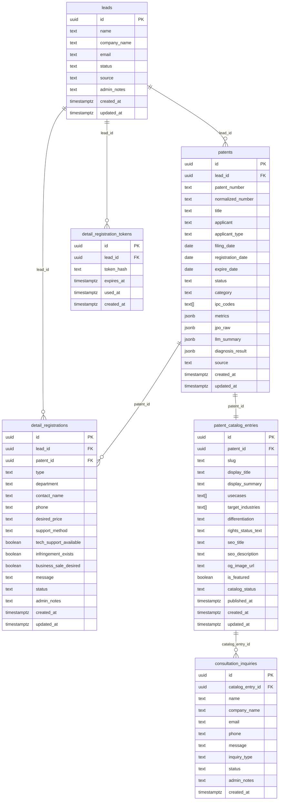

# データベーススキーマ仕様書

## 概要

- データベース: Supabase PostgreSQL
- RLS（Row Level Security）: 全テーブルで有効
- 拡張機能: `pgcrypto`（UUID生成に使用）
- 共有DB: `patent-revenue` / `patent-catalog` / `ip-rich-phase2` の3プロジェクトで共有

---

## テーブル一覧

| # | テーブル名 | 概要 |
|---|-----------|------|
| 1 | `leads` | リード（顧客）管理 |
| 2 | `patents` | 特許データ |
| 3 | `detail_registration_tokens` | 詳細登録トークン |
| 4 | `detail_registrations` | 詳細登録情報 |
| 5 | `patent_catalog_entries` | 公開カタログ |
| 6 | `consultation_inquiries` | 問い合わせ |

---

## テーブル詳細

### 1. `leads` — リード（顧客）管理

LP簡易調査フォームからの入力を管理する。

#### カラム

| カラム名 | 型 | 制約 | デフォルト | 説明 |
|---------|-----|------|-----------|------|
| `id` | `uuid` | PRIMARY KEY | `gen_random_uuid()` | レコードID |
| `name` | `text` | NOT NULL | — | 氏名 |
| `company_name` | `text` | NOT NULL | — | 会社名 |
| `email` | `text` | NOT NULL | — | メールアドレス |
| `status` | `text` | NOT NULL, CHECK | `'created'` | ステータス（ENUM参照） |
| `source` | `text` | — | NULL | 流入元（utm_source等） |
| `admin_notes` | `text` | — | NULL | 管理者メモ（002追加） |
| `created_at` | `timestamptz` | NOT NULL | `now()` | 作成日時 |
| `updated_at` | `timestamptz` | NOT NULL | `now()` | 更新日時（トリガー自動更新） |

#### ステータスENUM

`status` に設定可能な値（002マイグレーションで拡張済み）:

```
created → submitted → emailed → detail_started → detail_submitted
                                                       ↓
                                               contacted → converted → closed
```

| 値 | 説明 |
|----|------|
| `created` | リード作成直後 |
| `submitted` | フォーム送信済み |
| `emailed` | メール送信済み |
| `detail_started` | 詳細登録開始 |
| `detail_submitted` | 詳細登録完了 |
| `contacted` | 連絡済み |
| `converted` | 成約 |
| `closed` | クローズ |

#### インデックス

| インデックス名 | カラム | 説明 |
|--------------|--------|------|
| `idx_leads_email` | `email` | メール検索 |
| `idx_leads_status` | `status` | ステータス絞り込み |
| `idx_leads_created_at` | `created_at DESC` | 新着順ソート |

#### RLSポリシー

| ポリシー名 | ロール | 操作 | 条件 |
|-----------|-------|------|------|
| `leads_service_role_all` | `service_role` | ALL | 無条件（全操作可） |
| （anon アクセス不可） | `anon` | — | ポリシーなし |

---

### 2. `patents` — 特許データ

JPO API + LLM から取得した特許元データを管理する。

#### カラム

| カラム名 | 型 | 制約 | デフォルト | 説明 |
|---------|-----|------|-----------|------|
| `id` | `uuid` | PRIMARY KEY | `gen_random_uuid()` | レコードID |
| `lead_id` | `uuid` | FK → `leads.id` ON DELETE SET NULL | NULL | 紐づくリードID |
| `patent_number` | `text` | NOT NULL | — | 特許番号（元番号） |
| `normalized_number` | `text` | — | NULL | 正規化済み特許番号 |
| `title` | `text` | — | NULL | 発明の名称 |
| `applicant` | `text` | — | NULL | 出願人名 |
| `applicant_type` | `text` | CHECK | NULL | 出願人種別（ENUM参照） |
| `filing_date` | `date` | — | NULL | 出願日 |
| `registration_date` | `date` | — | NULL | 登録日 |
| `expire_date` | `date` | — | NULL | 満了日 |
| `status` | `text` | CHECK | NULL | 特許ステータス（ENUM参照） |
| `category` | `text` | — | NULL | カテゴリ |
| `ipc_codes` | `text[]` | — | NULL | IPCコード配列 |
| `metrics` | `jsonb` | — | NULL | 定量指標（citations, claimCount, familySize等） |
| `jpo_raw` | `jsonb` | — | NULL | JPO APIレスポンス生データ |
| `llm_summary` | `jsonb` | — | NULL | LLM生成の概要・強み・分野 |
| `diagnosis_result` | `jsonb` | — | NULL | 2層評価結果（スコア、価値レンジ、ランク等） |
| `source` | `text` | CHECK | NULL | データソース（ENUM参照） |
| `created_at` | `timestamptz` | NOT NULL | `now()` | 作成日時 |
| `updated_at` | `timestamptz` | NOT NULL | `now()` | 更新日時（トリガー自動更新） |

#### ステータスENUM

`applicant_type` に設定可能な値:

| 値 | 説明 |
|----|------|
| `'企業'` | 法人出願 |
| `'大学'` | 大学・研究機関出願 |
| `'個人'` | 個人出願 |
| `NULL` | 不明 |

`status` に設定可能な値:

```
出願中 → 登録 → 消滅
```

| 値 | 説明 |
|----|------|
| `'登録'` | 特許登録済み |
| `'消滅'` | 権利消滅 |
| `'出願中'` | 審査中 |
| `NULL` | 不明 |

`source` に設定可能な値:

| 値 | 説明 |
|----|------|
| `'jpo-api'` | JPO APIから取得 |
| `'llm'` | LLMから生成 |
| `'mock'` | モックデータ |
| `NULL` | 不明 |

#### インデックス

| インデックス名 | カラム | 説明 |
|--------------|--------|------|
| `idx_patents_patent_number` | `patent_number` | 特許番号検索 |
| `idx_patents_normalized_number` | `normalized_number` | 正規化番号検索 |
| `idx_patents_lead_id` | `lead_id` | リード紐付け検索 |
| `idx_patents_status` | `status` | ステータス絞り込み |
| `idx_patents_category` | `category` | カテゴリ絞り込み |
| `idx_patents_applicant_type` | `applicant_type` | 出願人種別絞り込み |
| `idx_patents_filing_date` | `filing_date DESC` | 出願日ソート |

#### RLSポリシー

| ポリシー名 | ロール | 操作 | 条件 |
|-----------|-------|------|------|
| `patents_service_role_all` | `service_role` | ALL | 無条件（全操作可） |
| （anon アクセス不可） | `anon` | — | ポリシーなし |

---

### 3. `detail_registration_tokens` — 詳細登録トークン

詳細登録フォームへの認証トークンを管理する。

#### カラム

| カラム名 | 型 | 制約 | デフォルト | 説明 |
|---------|-----|------|-----------|------|
| `id` | `uuid` | PRIMARY KEY | `gen_random_uuid()` | レコードID |
| `lead_id` | `uuid` | NOT NULL, FK → `leads.id` ON DELETE CASCADE | — | 紐づくリードID |
| `token_hash` | `text` | NOT NULL, UNIQUE | — | SHA-256等でハッシュ化されたトークン |
| `expires_at` | `timestamptz` | NOT NULL | — | トークン有効期限 |
| `used_at` | `timestamptz` | — | NULL | 使用日時（NULL=未使用） |
| `created_at` | `timestamptz` | NOT NULL | `now()` | 作成日時 |

#### インデックス

| インデックス名 | カラム | 説明 |
|--------------|--------|------|
| `idx_drt_lead_id` | `lead_id` | リード紐付け検索 |
| `idx_drt_expires_at` | `expires_at` | 期限切れトークン検索 |

#### RLSポリシー

| ポリシー名 | ロール | 操作 | 条件 |
|-----------|-------|------|------|
| `drt_service_role_all` | `service_role` | ALL | 無条件（全操作可） |
| （anon アクセス不可） | `anon` | — | ポリシーなし |

---

### 4. `detail_registrations` — 詳細登録情報

特許の売却・ライセンス登録詳細情報を管理する。

#### カラム

| カラム名 | 型 | 制約 | デフォルト | 説明 |
|---------|-----|------|-----------|------|
| `id` | `uuid` | PRIMARY KEY | `gen_random_uuid()` | レコードID |
| `lead_id` | `uuid` | NOT NULL, FK → `leads.id` ON DELETE CASCADE | — | 紐づくリードID |
| `patent_id` | `uuid` | FK → `patents.id` ON DELETE SET NULL | NULL | 紐づく特許ID |
| `type` | `text` | CHECK | NULL | 登録種別（ENUM参照） |
| `department` | `text` | — | NULL | 部署名 |
| `contact_name` | `text` | — | NULL | 担当者名 |
| `phone` | `text` | — | NULL | 電話番号 |
| `desired_price` | `text` | — | NULL | 希望価格 |
| `support_method` | `text` | CHECK | NULL | 支援方法（ENUM参照） |
| `tech_support_available` | `boolean` | — | NULL | 技術サポート提供可否 |
| `infringement_exists` | `boolean` | — | NULL | 侵害事例の有無 |
| `business_sale_desired` | `boolean` | — | NULL | 事業売却希望の有無 |
| `message` | `text` | — | NULL | メッセージ・備考 |
| `status` | `text` | NOT NULL, CHECK | `'pending'` | 処理ステータス（ENUM参照） |
| `admin_notes` | `text` | — | NULL | 管理者メモ（002追加） |
| `created_at` | `timestamptz` | NOT NULL | `now()` | 作成日時 |
| `updated_at` | `timestamptz` | NOT NULL | `now()` | 更新日時（トリガー自動更新） |

#### ステータスENUM

`type` に設定可能な値:

| 値 | 説明 |
|----|------|
| `'listing'` | 売却・ライセンス登録 |
| `'consulting'` | 相談 |
| `NULL` | 未設定 |

`support_method` に設定可能な値:

| 値 | 説明 |
|----|------|
| `'ライセンス'` | ライセンス希望 |
| `'売却'` | 売却希望 |
| `'両方'` | ライセンス・売却の両方希望 |
| `NULL` | 未設定 |

`status` の状態遷移:

```
pending → reviewed → contacted → converted
                              ↘ closed
```

| 値 | 説明 |
|----|------|
| `'pending'` | 受付済み・未確認 |
| `'reviewed'` | 確認済み |
| `'contacted'` | 連絡済み |
| `'converted'` | 成約 |
| `'closed'` | クローズ |

#### インデックス

| インデックス名 | カラム | 説明 |
|--------------|--------|------|
| `idx_dr_lead_id` | `lead_id` | リード紐付け検索 |
| `idx_dr_patent_id` | `patent_id` | 特許紐付け検索 |
| `idx_dr_status` | `status` | ステータス絞り込み |

#### RLSポリシー

| ポリシー名 | ロール | 操作 | 条件 |
|-----------|-------|------|------|
| `dr_service_role_all` | `service_role` | ALL | 無条件（全操作可） |
| （anon アクセス不可） | `anon` | — | ポリシーなし |

---

### 5. `patent_catalog_entries` — 公開カタログ

SEO向けに編集した公開表現を管理する（`patents` テーブルとは別管理）。

#### カラム

| カラム名 | 型 | 制約 | デフォルト | 説明 |
|---------|-----|------|-----------|------|
| `id` | `uuid` | PRIMARY KEY | `gen_random_uuid()` | レコードID |
| `patent_id` | `uuid` | NOT NULL, UNIQUE, FK → `patents.id` ON DELETE CASCADE | — | 紐づく特許ID（1対1） |
| `slug` | `text` | NOT NULL, UNIQUE | — | URL用スラッグ（英数字+ハイフン） |
| `display_title` | `text` | — | NULL | 表示用タイトル |
| `display_summary` | `text` | — | NULL | 表示用概要 |
| `usecases` | `text[]` | — | NULL | ユースケース配列 |
| `target_industries` | `text[]` | — | NULL | 対象業界配列 |
| `differentiation` | `text` | — | NULL | 差別化ポイント |
| `rights_status_text` | `text` | — | NULL | 権利状態の表示テキスト |
| `seo_title` | `text` | — | NULL | SEOタイトル |
| `seo_description` | `text` | — | NULL | SEOメタディスクリプション |
| `og_image_url` | `text` | — | NULL | OGP画像URL |
| `is_featured` | `boolean` | NOT NULL | `false` | 注目特許フラグ |
| `catalog_status` | `text` | NOT NULL, CHECK | `'draft'` | カタログステータス（ENUM参照） |
| `published_at` | `timestamptz` | — | NULL | 公開日時 |
| `created_at` | `timestamptz` | NOT NULL | `now()` | 作成日時 |
| `updated_at` | `timestamptz` | NOT NULL | `now()` | 更新日時（トリガー自動更新） |

#### ステータスENUM

`catalog_status` の状態遷移:

```
draft → review → published → hidden
                           ↘ archived
```

| 値 | 説明 |
|----|------|
| `'draft'` | 下書き |
| `'review'` | レビュー中 |
| `'published'` | 公開中 |
| `'hidden'` | 非表示 |
| `'archived'` | アーカイブ済み |

#### インデックス

| インデックス名 | カラム | 条件 | 説明 |
|--------------|--------|------|------|
| `idx_pce_catalog_status_published_at` | `(catalog_status, published_at DESC)` | `WHERE catalog_status = 'published'` | 公開済み一覧取得（部分インデックス） |
| `idx_pce_is_featured` | `is_featured` | `WHERE is_featured = true` | 注目特許フィルタ（部分インデックス） |
| `idx_pce_patent_id` | `patent_id` | — | 特許紐付け検索 |

#### RLSポリシー

| ポリシー名 | ロール | 操作 | 条件 |
|-----------|-------|------|------|
| `pce_anon_read_published` | `anon` | SELECT | `catalog_status = 'published'` のみ |
| `pce_service_role_all` | `service_role` | ALL | 無条件（全操作可） |

---

### 6. `consultation_inquiries` — 問い合わせ

カタログ経由の買い手・ライセンシー候補からの問い合わせを管理する。

#### カラム

| カラム名 | 型 | 制約 | デフォルト | 説明 |
|---------|-----|------|-----------|------|
| `id` | `uuid` | PRIMARY KEY | `gen_random_uuid()` | レコードID |
| `catalog_entry_id` | `uuid` | FK → `patent_catalog_entries.id` ON DELETE SET NULL | NULL | 紐づくカタログエントリID（NULLの場合はカタログ外からの問い合わせ） |
| `name` | `text` | NOT NULL | — | 問い合わせ者名 |
| `company_name` | `text` | — | NULL | 会社名 |
| `email` | `text` | NOT NULL | — | メールアドレス |
| `phone` | `text` | — | NULL | 電話番号 |
| `message` | `text` | NOT NULL | — | 問い合わせ内容 |
| `inquiry_type` | `text` | NOT NULL, CHECK | `'other'` | 問い合わせ種別（ENUM参照） |
| `status` | `text` | NOT NULL, CHECK | `'new'` | 対応ステータス（ENUM参照） |
| `admin_notes` | `text` | — | NULL | 管理者メモ（002追加） |
| `created_at` | `timestamptz` | NOT NULL | `now()` | 作成日時 |

> `updated_at` カラムはなし（更新操作を想定しないため）

#### ステータスENUM

`inquiry_type` に設定可能な値:

| 値 | 説明 |
|----|------|
| `'license'` | ライセンス問い合わせ |
| `'purchase'` | 購入問い合わせ |
| `'consultation'` | 相談 |
| `'other'` | その他 |

`status` の状態遷移:

```
new → replied → closed
```

| 値 | 説明 |
|----|------|
| `'new'` | 新規（未対応） |
| `'replied'` | 返信済み |
| `'closed'` | クローズ |

#### インデックス

| インデックス名 | カラム | 説明 |
|--------------|--------|------|
| `idx_ci_catalog_entry_id` | `catalog_entry_id` | カタログエントリ紐付け検索 |
| `idx_ci_status` | `status` | ステータス絞り込み |
| `idx_ci_created_at` | `created_at DESC` | 新着順ソート |

#### RLSポリシー

| ポリシー名 | ロール | 操作 | 条件 |
|-----------|-------|------|------|
| `ci_anon_insert` | `anon` | INSERT | 無条件（問い合わせフォームからの投稿） |
| `ci_service_role_all` | `service_role` | ALL | 無条件（全操作可） |

---

## ER図（Mermaid）



---

## RLSポリシーまとめ

| テーブル | anon | service_role |
|---------|------|--------------|
| `leads` | アクセス不可 | 全操作可 |
| `patents` | アクセス不可 | 全操作可 |
| `detail_registration_tokens` | アクセス不可 | 全操作可 |
| `detail_registrations` | アクセス不可 | 全操作可 |
| `patent_catalog_entries` | `catalog_status = 'published'` のレコードのみ SELECT 可 | 全操作可 |
| `consultation_inquiries` | INSERT のみ可（SELECT 不可） | 全操作可 |

### ポリシー設計の考え方

- **内部データ（leads, patents, tokens, registrations）**: `service_role` のみアクセス可。外部に公開しない。
- **公開カタログ（patent_catalog_entries）**: `anon` は公開済みレコードのみ参照可。下書き・レビュー中・非表示のデータは見えない。
- **問い合わせ（consultation_inquiries）**: `anon` は投稿（INSERT）のみ可。投稿した内容も含め、一覧・詳細の参照は不可。

---

## トリガー

`updated_at` を自動更新するトリガーが以下のテーブルに設定されている:

| テーブル | トリガー名 |
|---------|-----------|
| `leads` | `set_leads_updated_at` |
| `patents` | `set_patents_updated_at` |
| `detail_registrations` | `set_detail_registrations_updated_at` |
| `patent_catalog_entries` | `set_patent_catalog_entries_updated_at` |

```sql
-- 共通のトリガー関数
CREATE OR REPLACE FUNCTION trigger_set_updated_at()
RETURNS TRIGGER LANGUAGE plpgsql AS $$
BEGIN
    NEW.updated_at = now();
    RETURN NEW;
END;
$$;
```

> `detail_registration_tokens` と `consultation_inquiries` には `updated_at` カラムがないため、トリガーは設定されていない。

---

## マイグレーション履歴

| ファイル | 内容 |
|---------|------|
| `001_initial_schema.sql` | 初期スキーマ（全6テーブル + インデックス + RLS + トリガー） |
| `002_admin_dashboard.sql` | 管理画面対応。`leads`・`detail_registrations`・`consultation_inquiries` に `admin_notes` カラム追加。`leads.status` のCHECK制約を拡張（`submitted`, `contacted`, `converted`, `closed` を追加） |
